# Civitas – A Living Town for Fabric

A Fabric mod for **Minecraft 26.3**. Found a town and settlers arrive. They build it themselves, block by block. They farm, mine, fell trees, bake, butcher, forge, brew and build missiles, and they buy their bread with money (the **Commerce** mod's currency). They sleep in their own beds, gossip in the tavern, and live under your laws.

**Govern them well and they prosper.** Well-dressed citizens, a growing town, rising share prices.

**Squeeze them and you'll see it.** Their clothes wear to rags, they go hungry, they strike, protest in the square, steal bread and leave town for good.

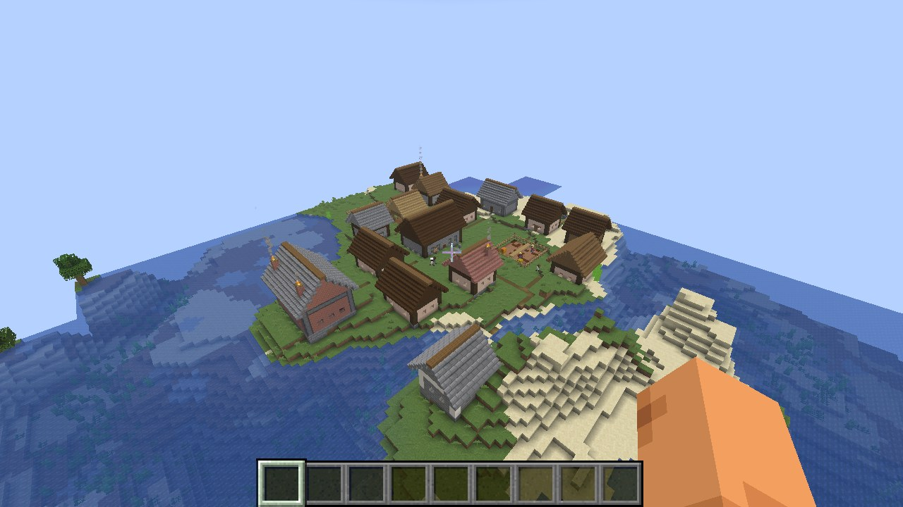

## Requirements

- Minecraft 26.3, Fabric loader 0.19.5+, Fabric API
- **Commerce** 1.0.0+: the currency, bank accounts and shop counters
- optional: **RedButton**, so the ordnance factory builds real missiles

## Founding a town

Craft a **Town Charter** (paper, gold, a book and quill, a feather) and use it on open, fairly flat ground. Name your town. The **town hall** is laid out right there, with its door facing you.

Five settlers arrive with you, and two of them start building. The town gets a founding grant of 1,500 for materials.

Once you govern a town, using the charter anywhere opens its **ledger**. So does the **Town Ledger** on the clerk's desk in the town hall.

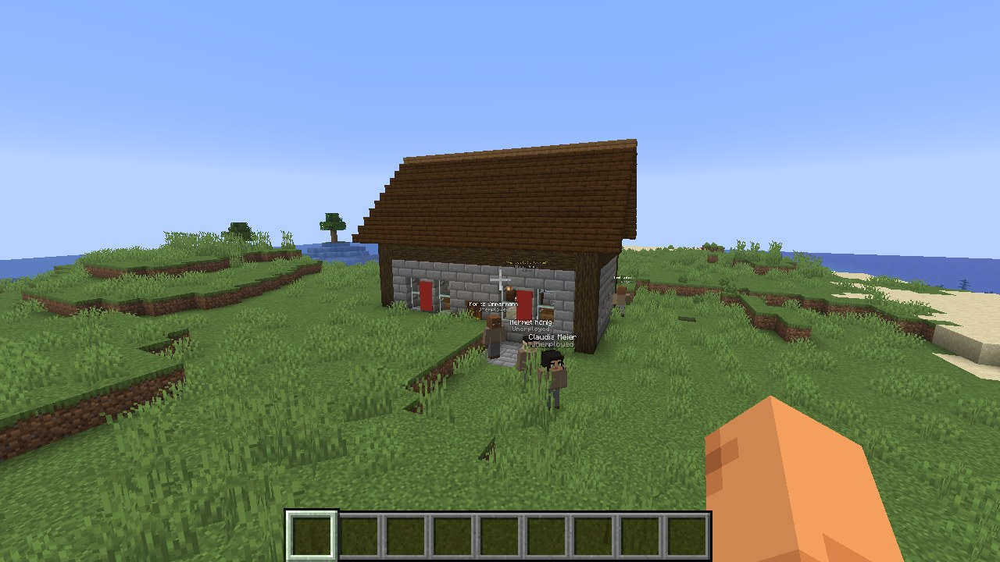

## The people

Every citizen is a person with:

- a **name** floating above their head, with their job underneath and, now and then, what's on their mind in yellow
- a face and hair of their own, and the work clothes of their trade
- their own **bank account**: wages come in; rent, taxes, food and clothes go out

Their day:

| Time | What they do |
|---|---|
| 6:00 | get up |
| 7:00 | go to work for as many hours as your law says |
| after work | buy food at the bakery or butcher, maybe a drink at the tavern, stroll around town |
| 19:00 | go home and sleep in their bed, or rough by the town hall if they have no home |

Right-click a citizen to see their **card**:
- needs: happiness, food, rest, clothes
- money, wage, home and workplace
- the **reasons** they feel as they do: every factor with its plus or minus
- what's on their mind

Right-click with a coin in hand to give alms.

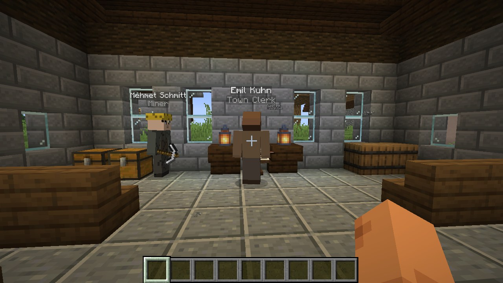

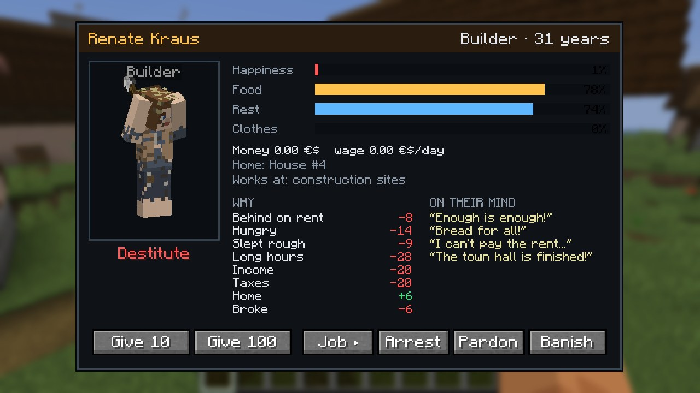

## The buildings

Builders clear the site, lay foundations, raise the walls layer by layer, fit the doors, beds and lanterns, and finally pave a path to the square. Materials come from the town's **stockpile**, which the mine and lumber mill fill. Anything missing is bought with treasury money. When the treasury runs dry, construction halts.

| Building | Who works there | What it does |
|---|---|---|
| Town Hall | clerk, builders | seat of government; the town ledger; the square in front |
| House | – | beds for four |
| Farm | 2 farmers | till, sow, tend and harvest wheat, carrots and potatoes for real |
| Bakery | baker | bakes bread from the farm's wheat and sells it at its counter |
| Butcher | butcher | keeps cattle and pigs in the pen, slaughters, roasts and sells meat |
| Mine | 3 miners | dig a real staircase down to Y 0, then galleries; ore and stone come up |
| Lumber Mill | 2 lumberjacks | fell nearby trees and replant saplings; timber for building |
| Blacksmith | smith | smelts the mine's iron and forges tools for sale |
| Tavern | innkeeper | brews ale from wheat; citizens spend their evenings there |
| Sheriff's Office | 2 sheriffs | patrol, fight monsters, arrest thieves |
| Prison | – | cells; prisoners serve their sentence |
| Bank | banker | Commerce bank terminals for everyone |
| Ordnance Factory | 3 workers | iron, gunpowder and redstone become missiles (RedButton) or TNT |

The businesses trade with each other:
- the baker walks to the farm, buys a batch of wheat and carries it home
- the smith fetches ore from the mine; the factory buys ingots from the smith
- what the town doesn't produce is ordered from the market

Each business has its own account. Profits go to the treasury, and surplus produce is sold on the Commerce market. The factory delivers its missiles to the state arms buyer, and you can buy them at its counter.

Shop counters are real **Commerce** shop counters, so players buy bread, steak, ale, tools and missiles there too.

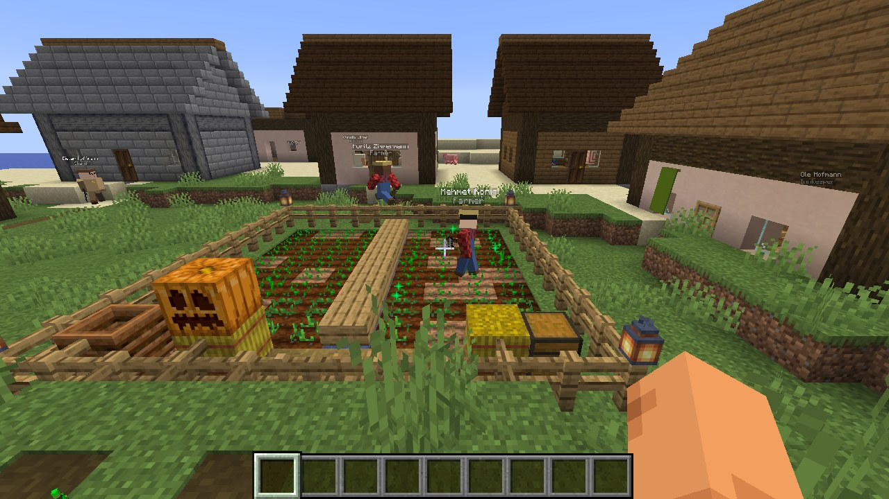
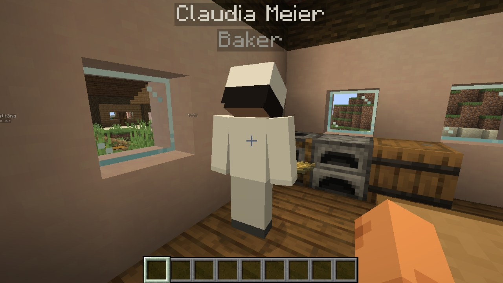
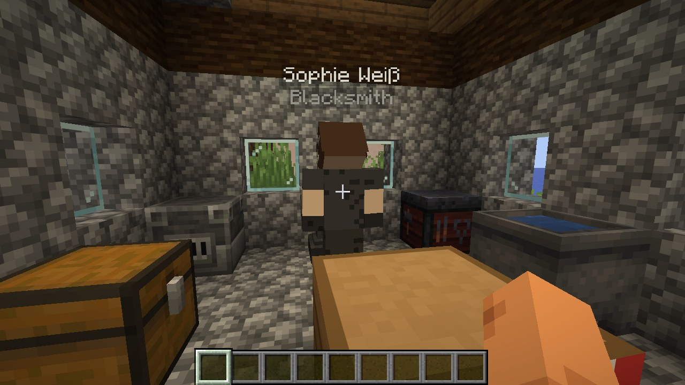
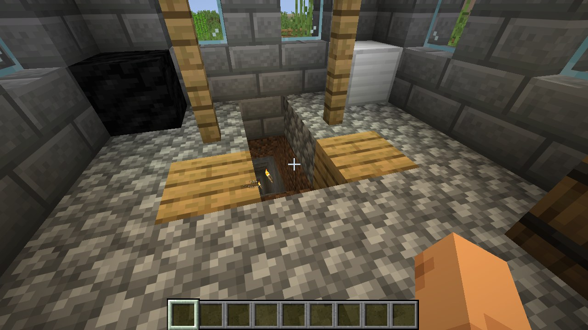

By default the town council plans what the town needs by itself: food first, then homes, timber, ore and the trades. You can switch that off and plan everything yourself.

## Governing

The **ledger** has five tabs.

- **Overview**: population and beds, employment, average happiness, treasury, yesterday's income and spending, and how people live (well-off, comfortable, poor, destitute). Charts of happiness and treasury, and the town chronicle.
- **Citizens**: everyone, with job, standard of living, mood, food and money. Click a name for their card.
  - As governor you can **reassign their job**, **arrest** them, **pardon** them or **banish** them.
- **Buildings**: construction progress, workers, residents, and each business's revenue and costs. Plan new buildings with one click; abandon old ones.
- **Laws**: see below.
- **Treasury**:
  - take money out for yourself, or donate
  - hold a **festival**
  - **take the town public** on the stock exchange
  - **confiscate everyone's savings**

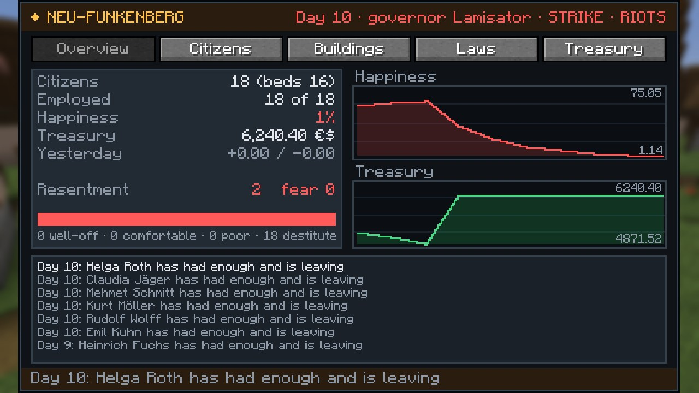
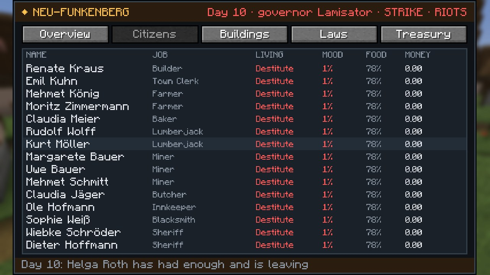
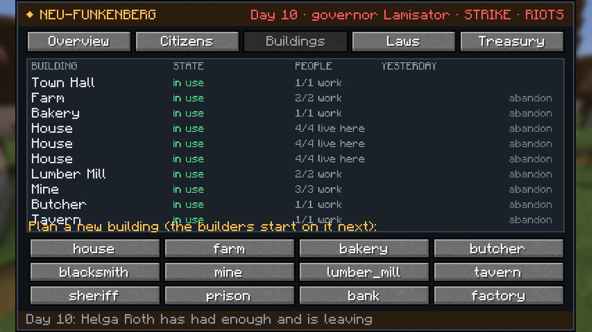
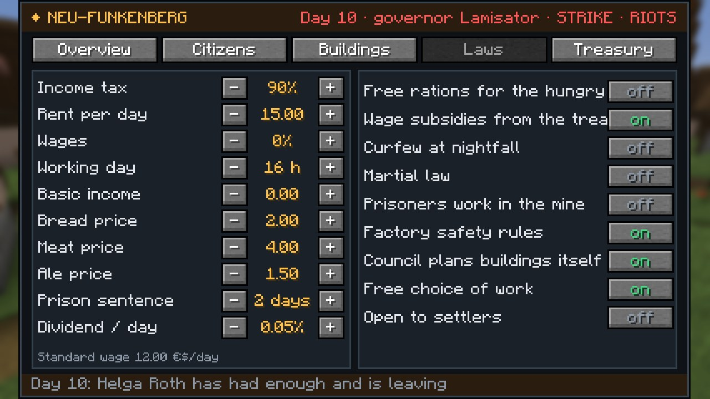
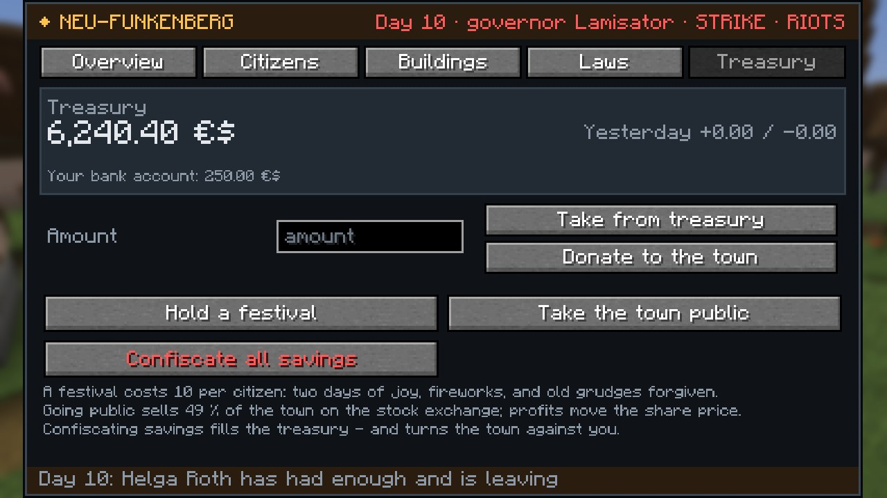

### The laws

| Law | Default | Effect |
|---|---|---|
| Income tax | 10 % | of wages, to the treasury |
| Rent | 2 / day | to the treasury |
| Wages | 100 % | of the standard wage (12 / day; miners, smiths, munitions workers and bankers get more) |
| Working day | 8 h | from 7:00; long days mean less sleep and more hunger |
| Basic income | 0 | paid to everyone every day |
| Bread, meat, ale prices | 2 / 4 / 1.50 | in the town's shops |
| Prison sentence | 2 days | per crime |
| Dividend | 0.05 %/day | if the town is listed |
| Free rations | off | the treasury feeds those who can't afford bread |
| Wage subsidies | on | the treasury pays wages a business can't |
| Curfew | off | everyone home at nightfall; less crime, less joy |
| Martial law | off | the sheriff arrests protest leaders |
| Forced labour | off | prisoners work in the mine, unpaid |
| Factory safety rules | on | off: faster, but explosions |
| Council plans buildings | on | |
| Free choice of work | on | the unemployed take open jobs by themselves |
| Open to settlers | on | new people move in when there are beds and the mood is good |

## For better or worse

Every morning each citizen takes stock of their life. Happiness drifts toward the sum of everything that matters:
- were they fed, did they sleep in a bed, how long did they work
- what's left of their wage after tax and rent, whether they have savings and a home
- the state of their clothes and an evening at the tavern
- crime, fear of arbitrary arrests, curfew and martial law
- festivals, gifts and grievances against the governor

**Good government** (fair wages, low taxes, short days, food for the hungry, festivals) makes **comfortable** citizens, and some become **well-off**. They buy new clothes when theirs wear out, settlers flock in, and businesses earn.

**Exploitation** shows in the street:
- Clothes wear out every day, faster with long hours and an empty stomach. Without money left over, nobody can replace them.
- Citizens go from plain clothes to **worn and patched**, then to **rags**: holes, torn shirts, trousers ripped off at the knee, bare feet, grime on their faces.
- Hungry citizens can't afford bread. After a few days without food, they **starve to death**.
- Unhappy towns **strike**: workers gather in the square, raise their fists and shout slogans instead of working. Below 15 % the town **riots**.
- The desperate **steal** from the shops, and the sheriff hunts them down and jails them.
- The miserable **pack up and leave**.
- Your **resentment** rating rises with confiscations, embezzlement and arbitrary arrests. It fades slowly, and a festival helps.

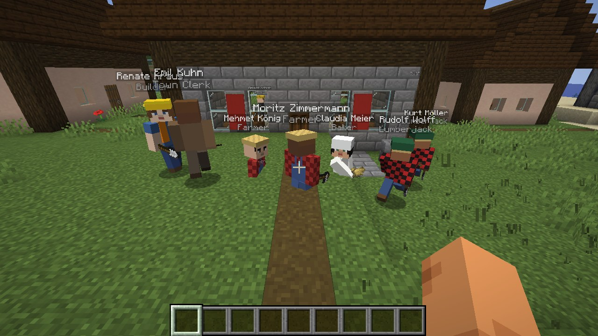
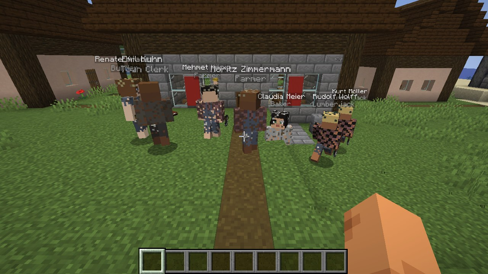
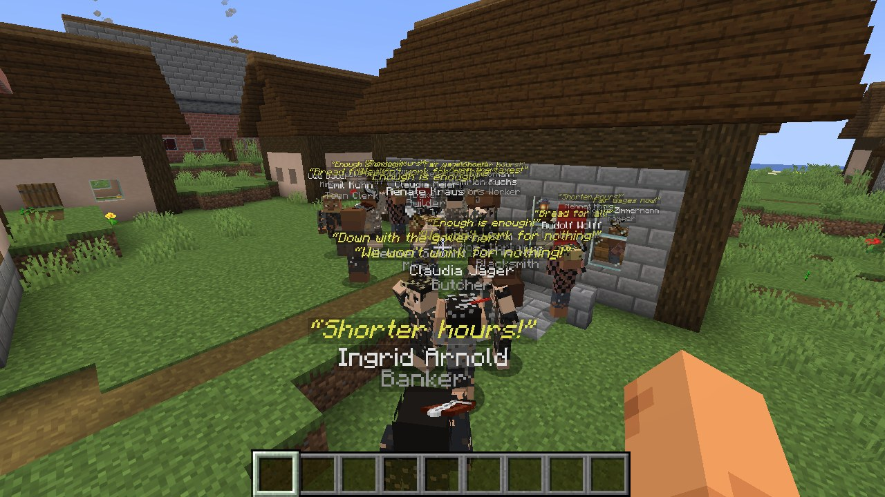

## On the stock exchange

**Take the town public** and Commerce lists it: the first letters of its name become the ticker. 49 % of 100,000 shares are sold to the market and the money goes to the treasury. The town keeps 51 %.

Every day the town reports its earnings, which move the share price. Strikes and riots make the news. Shareholders, including you, are paid the dividend you set.

## Commands

| Command | |
|---|---|
| `/civitas list` | all towns |
| `/civitas info [town]` | population, treasury, buildings, latest news |
| `/civitas govern [town]` | open the ledger |
| `/civitas found <name>` | found a town 10 blocks ahead (needs a charter in hand) |
| `/civitas build <type>` | operators: plan a building |
| `/civitas complete` | operators: finish all construction at once |
| `/civitas day` | operators: let a day pass |
| `/civitas immigrate <n>` | operators: settlers arrive |

## Configuration

`config/civitas.json`:

| Setting | Default | |
|---|---|---|
| `foundingGrant` | 1500 | the town's starting money |
| `founders` | 5 | settlers who come with you |
| `maxCitizens` | 40 | |
| `baseWage` | 12 | standard wage per day |
| `buildTicksPerBlock` | 6 | building speed |
| `keepTownsLoaded` | true | towns live on while nobody is near |
| `starvationDays` | 4 | 0 = nobody starves |
| `crime` | true | the desperate steal |
| `riotDamage` | false | rioters smash windows and start fires |
| `farmTendChance` | 0.02 | how much farmers speed up their crops |
| `mineDepthY` | 0 | how deep the mines dig |
| `missileExportPrice` | 450 | what the state pays for a missile |
| `importFood` | true | rations come from the market if the bakery is empty |

## Building from source

```
./gradlew build                                    # build/libs/civitas-1.0.0.jar (needs libs/commerce-1.0.0.jar)
./gradlew runClientGameTest -PwithRedButton=<jar>  # founds a town, governs it well and badly, takes screenshots
```

Skins, outfits and all other art come from `tools/gen_assets.py`.

## License

MIT
