# Civitas – A Living Town for Fabric

A Fabric mod for **Minecraft 26.3**. Found a town and settlers arrive. They build it themselves, block by block. They farm, mine, fell trees, bake, butcher, forge, brew and build missiles, and they buy their bread with money (the **Commerce** mod's currency). They sleep in their own beds, gossip in the tavern, and live under your laws.

**Govern them well and they prosper.** Well-dressed citizens, a growing town, rising share prices.

**Squeeze them and you'll see it.** Their clothes wear to rags, they go hungry, they strike, protest in the square, steal bread and leave town for good.


## Requirements

- Minecraft 26.3, Fabric loader 0.19.5+, Fabric API
- **Commerce** 1.0.0+: the currency, bank accounts and shop counters
- optional: **RedButton**, so the ordnance factory builds real missiles
- optional: **Arsenal** 1.1.1+, so soldiers carry M4A1 carbines, plate carriers and combat helmets

## Founding a town

Craft a **Town Charter** (paper, gold, a book and quill, a feather) and use it on open, fairly flat ground. Name your town. The **town hall** is laid out right there, with its door facing you.

Five settlers arrive with you, and two of them start building. The town gets a founding grant of 1,500 for materials.

Once you govern a town, using the charter anywhere opens its **ledger**. So does the **Town Ledger** on the clerk's desk in the town hall.


## The people

Every citizen is a person with:

- a **name** floating above their head, with their job underneath and, now and then, what's on their mind in yellow
- a face and hair of their own, and the work clothes of their trade
- their own **bank account**: wages come in; rent, taxes, food and clothes go out

Their day:

| Time | What they do |
|---|---|
| 6:00 | get up |
| 7:00 | go to work for as many hours as your law says |
| after work | buy food at the bakery or butcher, maybe a drink at the tavern, stroll around town |
| 19:00 | go home and sleep in their bed, or rough by the town hall if they have no home |

Right-click a citizen to see their **card**:
- needs: happiness, food, rest, clothes
- money, wage, home and workplace
- the **reasons** they feel as they do: every factor with its plus or minus
- what's on their mind

Right-click with a coin in hand to give alms.


## The buildings

Builders clear the site, lay foundations, raise the walls layer by layer, fit the doors, beds and lanterns, and finally pave a path to the square. Materials come from the town's **stockpile**, which the mine and lumber mill fill. Anything missing is bought with treasury money. When the treasury runs dry, construction halts.

| Building | Who works there | What it does |
|---|---|---|
| Town Hall | clerk, builders | seat of government; the town ledger; the square in front |
| House | – | beds for four |
| Farm | 2 farmers | till, sow, tend and harvest wheat, carrots and potatoes for real |
| Bakery | baker | bakes bread from the farm's wheat and sells it at its counter |
| Butcher | butcher | keeps cattle and pigs in the pen, slaughters, roasts and sells meat |
| Mine | 3 miners | dig a real staircase down to Y 0, then galleries; ore and stone come up |
| Lumber Mill | 2 lumberjacks | fell nearby trees and replant saplings; timber for building |
| Blacksmith | smith | smelts the mine's iron and forges tools for sale |
| Tavern | innkeeper | brews ale from wheat; citizens spend their evenings there |
| Sheriff's Office | 2 sheriffs | patrol, fight monsters, arrest thieves |
| Prison | – | cells; prisoners serve their sentence |
| Bank | banker | Commerce bank terminals for everyone |
| Ordnance Factory | 3 workers | iron, gunpowder and redstone become missiles (RedButton) or TNT |
| Barracks | 4 soldiers | defend the town day and night (see below) |

The businesses trade with each other:
- the baker walks to the farm, buys a batch of wheat and carries it home
- the smith fetches ore from the mine; the factory buys ingots from the smith
- what the town doesn't produce is ordered from the market

Each business has its own account. Profits go to the treasury, and surplus produce is sold on the Commerce market. The factory delivers its missiles to the state arms buyer, and you can buy them at its counter.

Shop counters are real **Commerce** shop counters, so players buy bread, steak, ale, tools and missiles there too.


### Three tiers

Every building comes in three tiers. A new building is planned on a plot big enough for its third tier. The first tier stands at the front of that plot, and each upgrade grows the building backwards and sideways around the same front door.

| | Tier I | Tier II | Tier III |
|---|---|---|---|
| Size | small, one storey | bigger, two storeys | much bigger, two or three storeys, often a cellar |
| Look | timber and plaster | lights by the door | stone ground floor, slate roof, shutters |
| Houses | 4 beds | 6 beds, bedrooms upstairs | 8 beds on two upper floors, a cellar for provisions |
| Workplaces | | one more worker, work 20 % brisker | one more worker again, 40 % brisker |
| Barracks | 4 soldiers | 6 | 8, armoury in the cellar |

Some of the other upgrades:
- the town hall gets a council chamber, then an archive, a treasury cellar and a clock tower
- the tavern gets guest rooms and a beer cellar
- the bank gets a vault
- the prison gets cells on every floor
- the butcher gets a cold store
- the mine gets a winding wheel
- the farm gets bigger fields, and at tier III a barn

A home in a grander house also makes its residents happier.

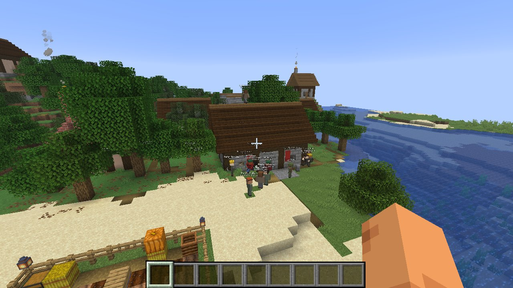
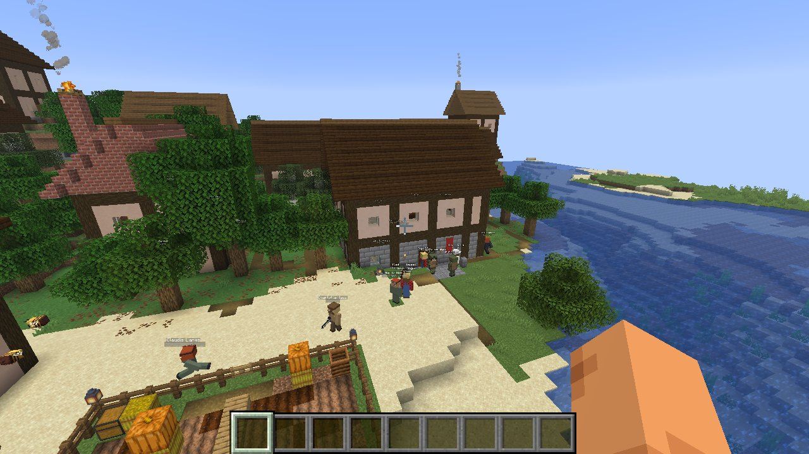
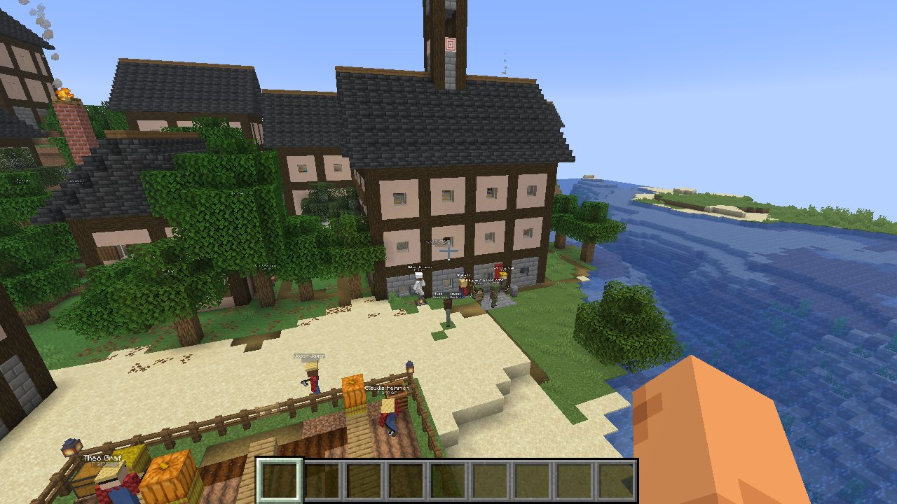
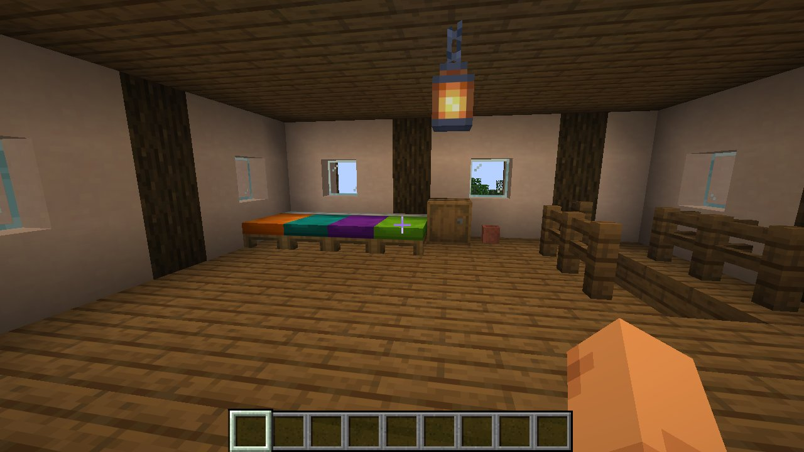

Each floor is four blocks high. A staircase along the inside of the side wall switches back from floor to floor, with railings round the stairwell.

**Unlocking.** The **town hall** goes up first: to tier II at 12 citizens, to tier III at 24 (`tier2Population`, `tier3Population`). Every other building can then be raised to the town hall's tier. New buildings are planned at the town hall's tier straight away. Each tier doubles the planning fee.

**Upgrading.** In the ledger's Buildings tab, click **↑ tier II** or **↑ tier III**. Hovering shows the cost, or why it isn't possible yet. The town council also upgrades by itself when nothing else is needed: the town hall first, then homes if beds are short, then the rest.

The builders take down only what changes. Chests and counters that stay keep their contents. Whatever comes down goes to the town's stockpile, including the contents of chests and barrels.

Buildings built before tiers (Civitas 1.1) keep their old shape until their first upgrade. Then the new plot is laid out around their front door, if nothing stands in the way.

### Getting in

Every building can be entered and used. The engine checks this at three points:

- **Blueprints.** Nothing may stand in a doorway. Every bed, workbench, chest, counter and seat must be reachable from the door. Each blueprint is checked when the server starts.
- **Planning.** Each site gets a walkable way from its door to the square, worked out over the real terrain. Where a bank of earth faces the door, the builders dig through it. Where the ground dips, they bank it up, by at most three blocks. No step is higher than one block. They never dig through a player's build. A site with no such way is not used. Nothing may later be built on a building's way.
- **Every day.** Each building is checked: doorways, rooms and the way to the square. Anything nature put in the way is cleared, such as earth, snow, saplings or a grown tree, and holes in the way are filled. If a player builds across the way, a new way around it is found. If there is none, the ledger's log says what blocks it.

By default the town council plans what the town needs by itself: food first, then homes, timber, ore and the trades. You can switch that off and plan everything yourself.

### Name signs and hidden lights

Every finished building gets a sign beside its door, at eye height: what it is, its number (the town's name on the town hall), and its tier. The sign is oak at tier I, spruce at tier II and dark oak with glowing white letters at tier III, and it is replaced when the building goes up a tier. Open buildings without a wall by the door (farms, forges) get the sign on a post beside the entrance.

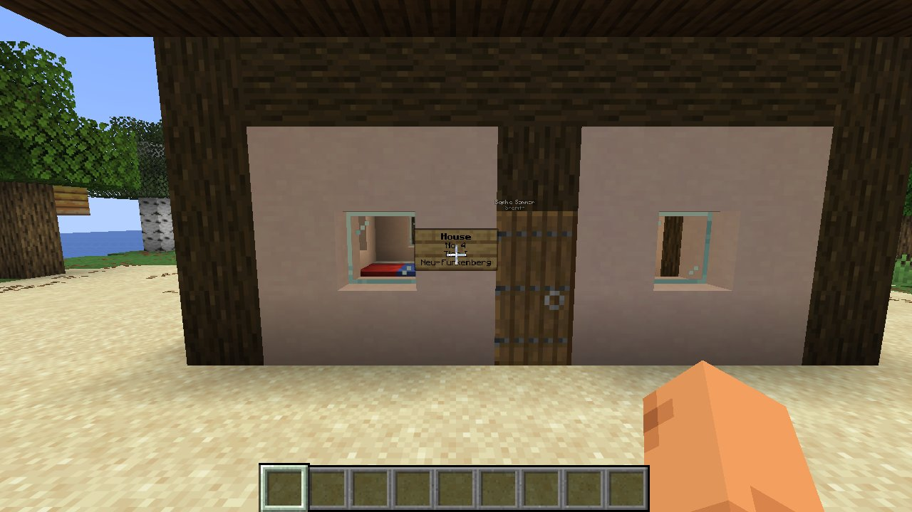

Pitched roofs leave sealed air under them: attics nobody can walk into, and cavities behind gables. Unlit, they would breed monsters, and the townsfolk nearby would flee from them. Every plan therefore carries hidden light blocks in each sealed pocket, spaced so no spot in it stays dark. The inspectors (below) also put them into buildings built before Civitas 1.3, within minutes of the server starting.

### Damage and repairs

Inspectors walk the town in rounds, one building every five seconds, then the wall, then the street lamps. They compare what stands with the plan. Blocks that are gone, burnt, blown away or buried under debris become a **repair**. Blocks someone else put in their place are reported, but left alone.

- Builders take repairs first, before new buildings, the wall and the streets. Materials come from the stockpile or are bought with treasury money. Doors and beds come back whole, walls before the lanterns that hang on them.
- The ledger's **Buildings** tab shows damage in the state column (`damaged (87%)`, `repairing 40%`). Click it to order the repair.
- **Auto-repair** (Works tab, on by default) repairs whatever the inspectors find. Switched off, damage waits until you order it: per building, or with **Repair all now**.
- What grows, what flows and the mine's staircase are not repaired: crops, saplings, leaves, flowers, water and the miners' own digging. Nor is earth that turned into path or field, or anything that couldn't stay where the plan puts it. Something hanging on a wall that is gone comes back after the wall does.
- The inspectors also keep the wall's gateways clear of whatever grows or falls into them.

| A blast against a house | Repaired by the builders |
|---|---|
| 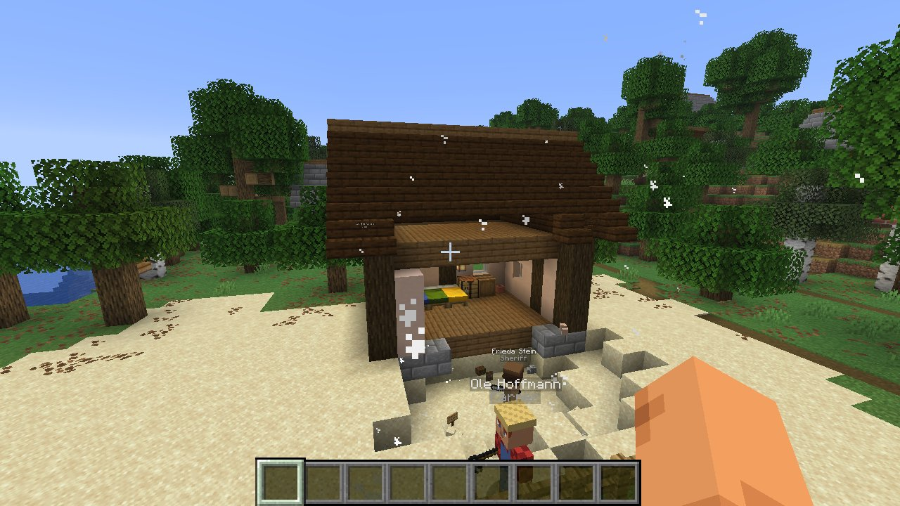 | 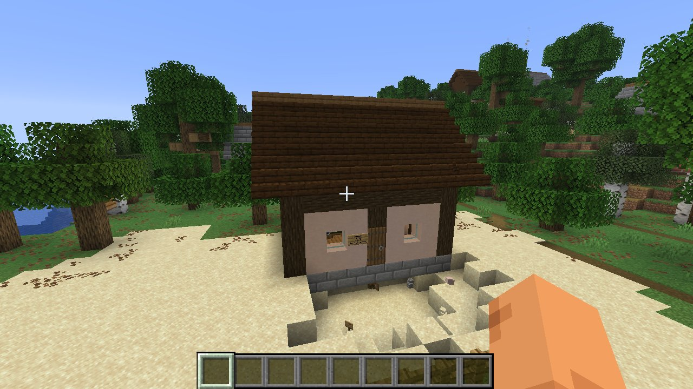 |

### The town wall

**Works → Build the wall** rings the town with a wall around every plot, way and street lamp, five blocks clear of them. It follows the ground and closes over water. There is a 3-block gate in every side, aimed at the town square's line, with more along long sides (no stretch longer than 56 blocks). The wall leaves a gap rather than run through anyone's build.

| | Tier I | Tier II | Tier III |
|---|---|---|---|
| Style | wooden palisade: spruce planks with fence pickets, posts every four blocks | cobblestone base under a spruce parapet with cobblestone merlons, lanterns on the gate posts | stone brick with battlements, corner towers three blocks higher, lanterns on the gate posts |
| Height | 4 | 5 | 5 (towers 8) |

| Tier I gate | Tier II gate | Tier III gate |
|---|---|---|
| 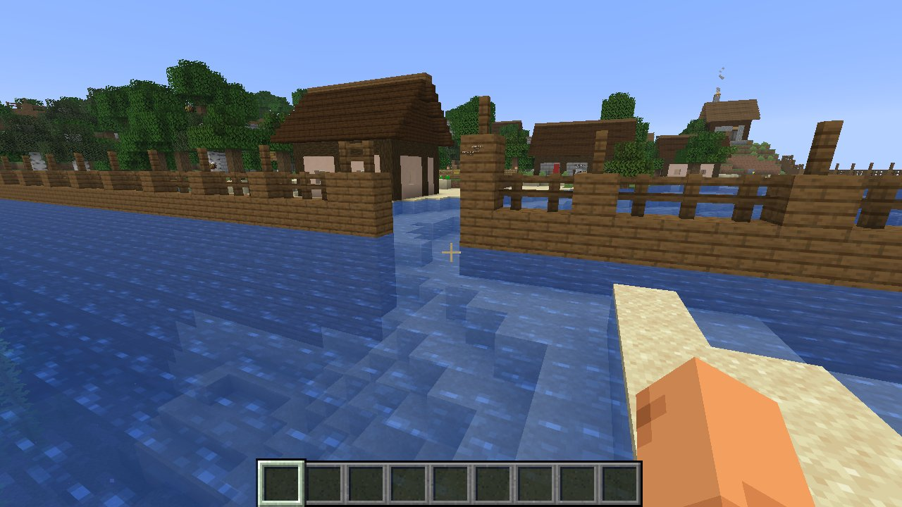 | 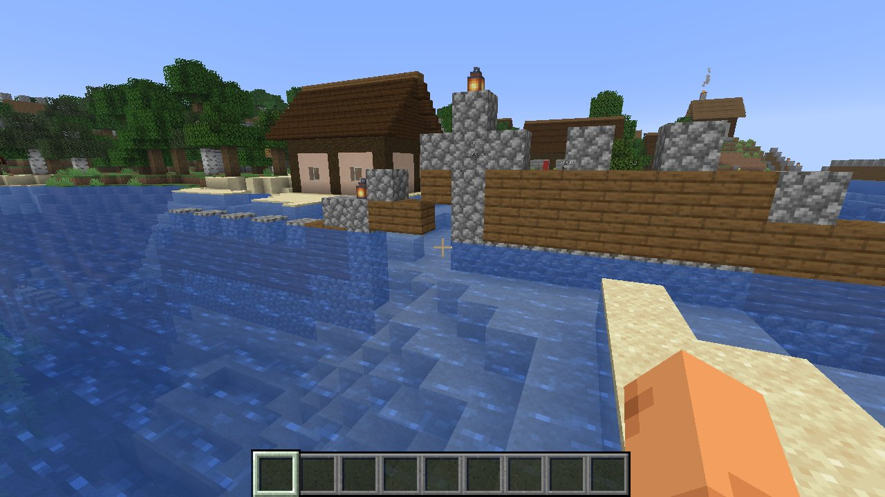 | 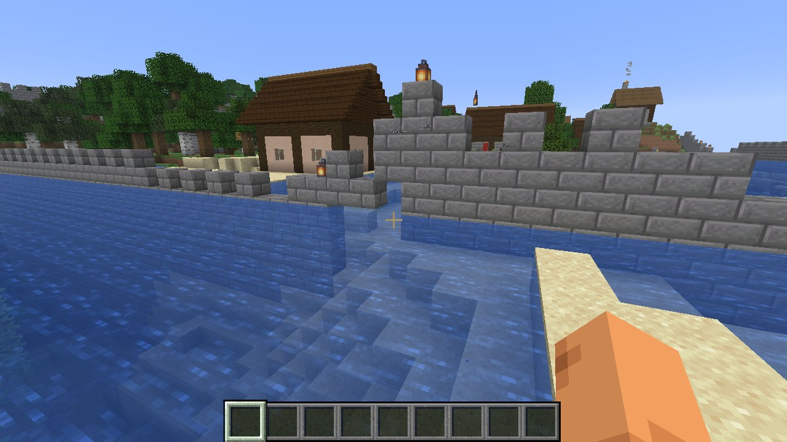 |

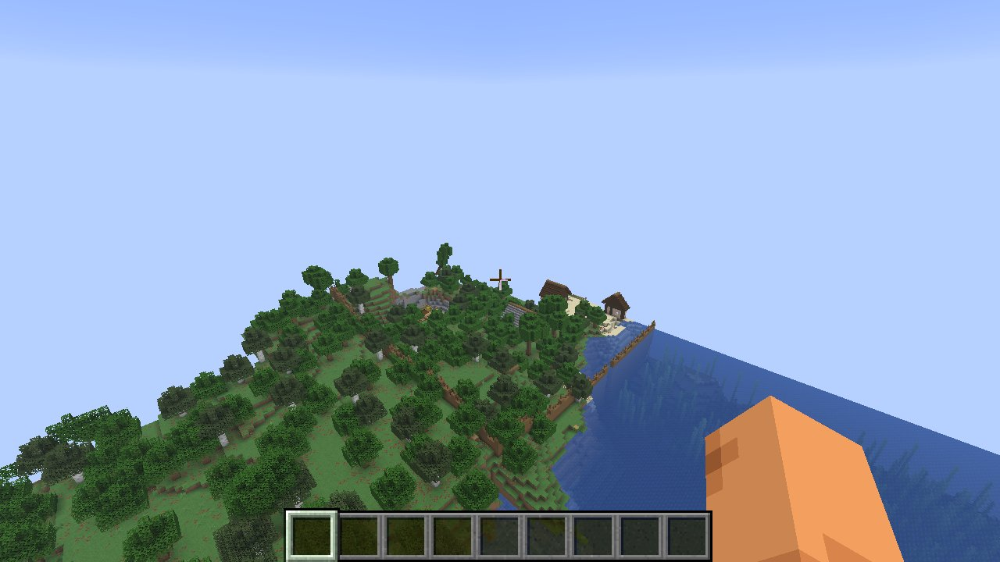

The wall keeps up with the town by itself. Once a day it is checked: when the town hall has gone up a tier, the wall is rebuilt in the new style. When the town has grown past it (a new plot or way too close or outside), it is moved outwards: the new stretch goes up and the old one comes down, its blocks going to the stockpile. Plots are never planned across the wall, and ways cross it only at gates. Damage to the wall is found and repaired like damage to buildings.

### Streets

**Works → Pave** paves every way with stone bricks where it runs over earth (dirt paths, grass, gravel). After that, **Lamps** puts a street lamp beside the ways every ten steps: a three-high spruce post with a lantern on top, clear of plots, the wall and the other lamps. Once ordered, new ways are paved and lit as they are made, once a day. Lamps are inspected and repaired like everything else.

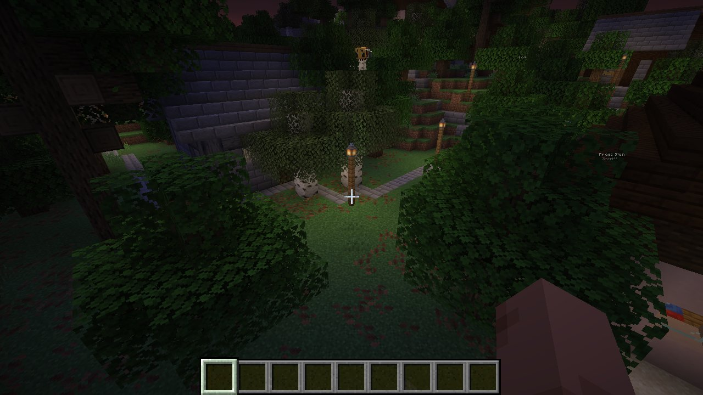

The Works tab shows the wall and the streets with their cost, the repairs, and every job in hand with its progress and the money still needed.

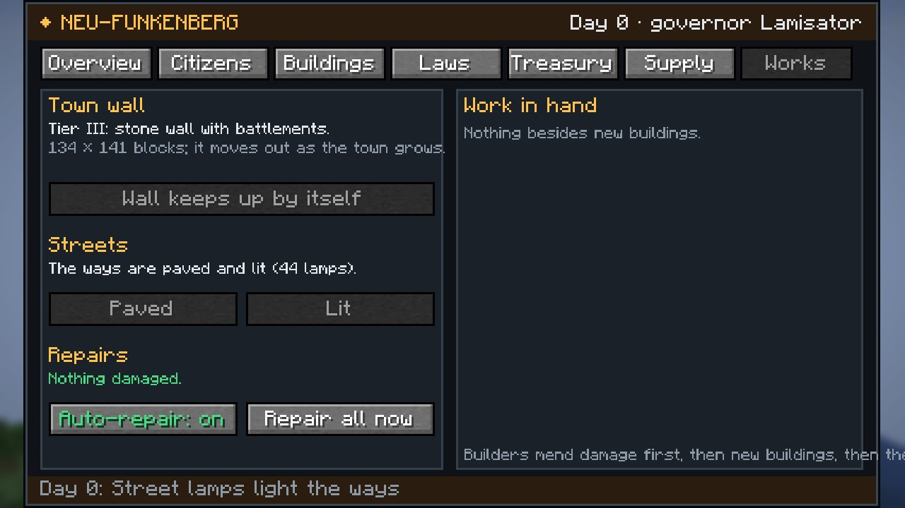

## Defence

From 12 citizens on, the town builds a **barracks**. It builds one from 6 citizens on if it was attacked in the last three days.

The barracks is a stone hall with:
- four bunks
- an armoury: Arsenal's weapon racks and ammunition crates, with spare rifles on the racks
- the duty officer's map table
- a parade ground with targets and the alarm bell

Soldiers wear Flecktarn camouflage, a helmet and body armour.

| | With Arsenal | Without |
|---|---|---|
| Weapon | M4A1 carbine (3-round bursts, real bullets, magazine changes); the fourth soldier is a marksman with an AWM | longbow |
| Armour | plate carrier and combat helmet | iron breastplate and helmet |

**Two watches.** The first and third soldier stand the day watch during working hours. The second and fourth stand the night watch from dusk to dawn and sleep in the barracks by day. Off duty they live like everyone else. On duty, sentries stand by the barracks door and the others walk the rounds: the square, the edge of town, the workshops.

**The alarm.** Every soldier turns out when there is an enemy in town, whatever the hour, waking from sleep if need be. When the threat is serious, the barracks bell rings: three or more enemies, raiders, or a hostile player.

Enemies are:
- monsters inside the town
- raiders
- anyone, mob or player, who hurt a citizen. A player stays an enemy for 5 minutes, a mob for 2.

Creative-mode players are never shot at.

Soldiers keep a friend out of their line of fire: they step aside rather than shoot through a citizen. Their rounds never hurt the town's own people or a peaceful visitor, even when a shot misses or goes through its target. They use the rifle butt when an enemy is close.

The governor and the deputies are never treated as enemies. If they strike a citizen, the log notes it and the guards look away.

Townsfolk run from danger they can see within 10 blocks, or from whoever just hurt them. A monster behind a wall, under the floor or in a sealed room doesn't scare them, and once it has been out of sight for two seconds they go back to what they were doing. Sheriffs and soldiers stand their ground.

**Enemies of the town.** Zombies, skeletons and illagers go for citizens as they do for villagers (`monstersAttackCitizens`). A prosperous town of 8 or more may be raided: a band of pillagers and vindicators gathers at the edge of town at dusk and marches on the square (`raidChance`, 8 % a day). The log reports where they came from and how the fight went.

Soldiers are paid by the treasury, at 1.4 times the base wage.

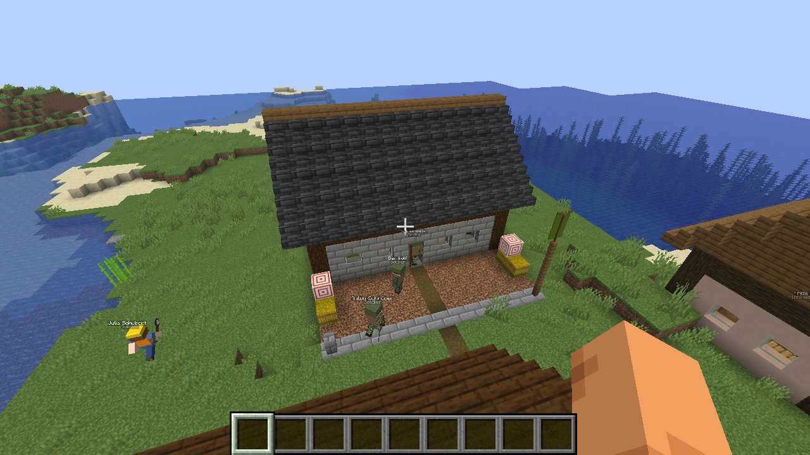
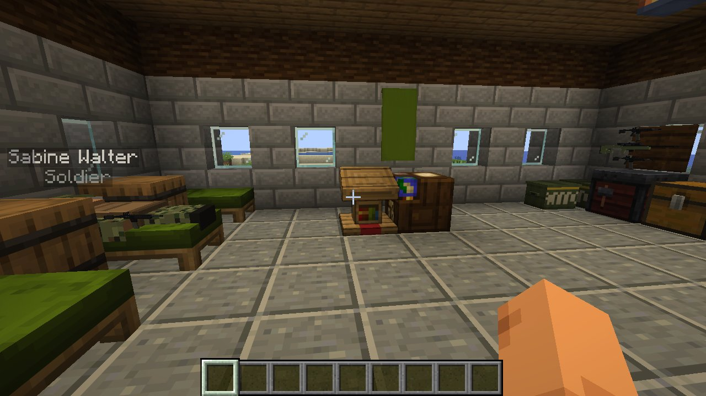

## Self-government

Hand the town to its **council** and it governs itself. In the ledger's Laws tab, click **Laws by: you** to cycle through the strategies, or use `/civitas council <strategy>`.

Each morning the council sets the day's laws. It moves step by step, a few points of tax a day rather than all at once, and the log says what it changed. It also plans the buildings its strategy favours, and it always plans buildings itself and lets people choose their work. You can take the reins back at any time.

| Strategy | What the council does |
|---|---|
| **Growth** | low taxes and rent, good wages, cheap bread, open doors (but no new settlers while people go hungry), rations for the hungry; more houses and farms |
| **Equality** | high income tax paid back to everyone as a basic income from what the treasury can spare, free rations, a 7-hour day, low prices, short sentences; a tavern early |
| **Prosperity** | moderate taxes, good wages, market prices, a 9-hour day, high dividends; the smithy, bank and factory first |
| **Order** | curfew, five-day sentences, martial law whenever there is unrest; sheriffs, barracks and prison first |
| **Extortion** | as hard as they will bear: high taxes, rents and prices, low wages, 14-hour days, forced labour, no safety rules, martial law at the first sign of unrest. Rations only for the starving. A quarter of whatever the treasury holds above its reserve goes to the governor every day. When they riot or break it eases off a little; when they're meek it squeezes harder. Mine, prison and factory first. |
| **Balanced** | steers for a content town with a steady treasury: lowers taxes and raises wages when spirits sink, raises them when people are happy but the treasury shrinks |

Every council except the extortionist's holds a festival when spirits are low and the treasury can afford it.

### Keeping a town loaded

Operators decide whether a town lives on while nobody is near: its land stays loaded and its citizens keep working, eating and sleeping. Use the **Load** switch in the Laws tab, visible only to operators, or `/civitas keeploaded on|off|default`. The default follows `keepTownsLoaded` in the server config. The server itself must keep running too: Minecraft pauses an empty server unless `pause-when-empty-seconds` is set to -1.

## Is everyone fed?

The ledger's **Supply** page checks the town's food link by link and says what to do about each gap:
- how many went hungry yesterday
- what's on the bakery and butcher counters, against what the town eats in a day (about two and a half loaves' worth per citizen)
- fields, farmers and open farm jobs, and roughly how much bread the wheat makes
- whether the bakery has a baker and wheat, and whether it can pay the farm for more
- the butcher's herd and raw meat, and whether it can afford new livestock
- how many citizens can't afford even the cheapest food, and how to fix it: wages, prices, a basic income or free rations
- whether settlers keep arriving while people go hungry

When people go hungry, the governor gets a message each morning.

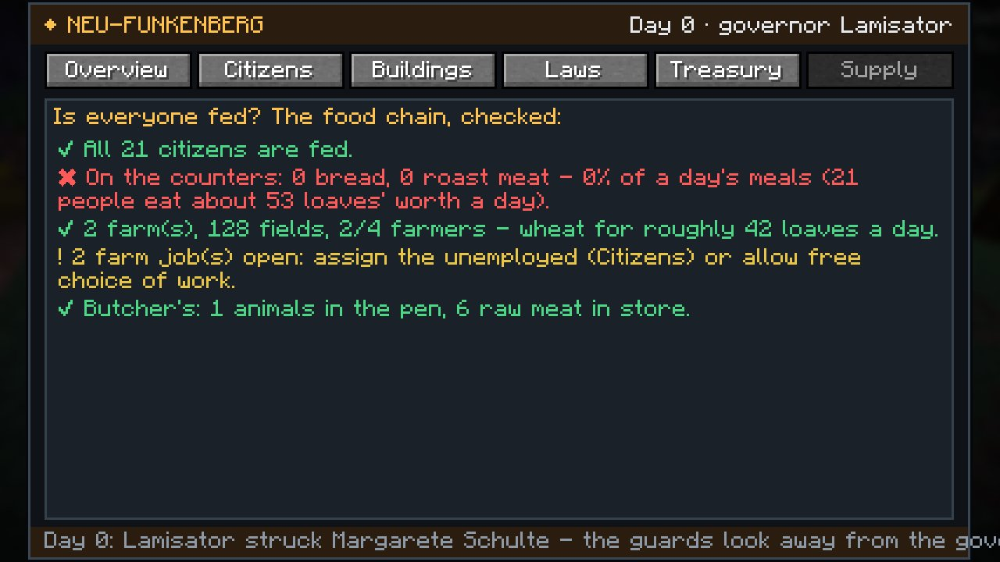

**A frozen world clock.** If the server stops time (gamerule `advance_time` false), days would never end: no wages, no rent, no counted meals, and people at work forever. Towns then keep their own clock, running on from where the world's clock stopped, with its own day and night (`ownClockWhenFrozen`).

## Governing

The **ledger** has five tabs.

- **Overview**: population and beds, employment, average happiness, treasury, yesterday's income and spending, and how people live (well-off, comfortable, poor, destitute). Charts of happiness and treasury, and the town chronicle.
- **Citizens**: everyone, with job, standard of living, mood, food and money. Click a name for their card.
  - As governor you can **reassign their job**, **arrest** them, **pardon** them or **banish** them.
- **Buildings**: construction progress, workers, residents, and each business's revenue and costs. Plan new buildings with one click; abandon old ones.
- **Laws**: see below.
- **Treasury**:
  - take money out for yourself, or donate
  - hold a **festival**
  - **take the town public** on the stock exchange
  - **confiscate everyone's savings**


### The laws

| Law | Default | Effect |
|---|---|---|
| Income tax | 10 % | of wages, to the treasury |
| Rent | 2 / day | to the treasury |
| Wages | 100 % | of the standard wage (12 / day; miners, smiths, munitions workers and bankers get more) |
| Working day | 8 h | from 7:00; long days mean less sleep and more hunger |
| Basic income | 0 | paid to everyone every day |
| Bread, meat, ale prices | 2 / 4 / 1.50 | in the town's shops |
| Prison sentence | 2 days | per crime |
| Dividend | 0.05 %/day | if the town is listed |
| Free rations | off | the treasury feeds those who can't afford bread |
| Wage subsidies | on | the treasury pays the wages and supplies a business can't afford (since 1.3.1 also its raw materials, so a bakery with an empty till still buys wheat) |
| Curfew | off | everyone home at nightfall; less crime, less joy |
| Martial law | off | the sheriff arrests protest leaders |
| Forced labour | off | prisoners work in the mine, unpaid |
| Factory safety rules | on | off: faster, but explosions |
| Council plans buildings | on | |
| Free choice of work | on | the unemployed take open jobs by themselves |
| Open to settlers | on | new people move in when there are beds and the mood is good |

## For better or worse

Every morning each citizen takes stock of their life. Happiness drifts toward the sum of everything that matters:
- were they fed, did they sleep in a bed, how long did they work
- what's left of their wage after tax and rent, whether they have savings and a home
- the state of their clothes and an evening at the tavern
- crime, fear of arbitrary arrests, curfew and martial law
- festivals, gifts and grievances against the governor

**Good government** (fair wages, low taxes, short days, food for the hungry, festivals) makes **comfortable** citizens, and some become **well-off**. They buy new clothes when theirs wear out, settlers flock in, and businesses earn.

**Exploitation** shows in the street:
- Clothes wear out every day, faster with long hours and an empty stomach. Without money left over, nobody can replace them.
- Citizens go from plain clothes to **worn and patched**, then to **rags**: holes, torn shirts, trousers ripped off at the knee, bare feet, grime on their faces.
- Hungry citizens can't afford bread. After a few days without food, they **starve to death**.
- Unhappy towns **strike**: workers gather in the square, raise their fists and shout slogans instead of working. Below 15 % the town **riots**.
- The desperate **steal** from the shops, and the sheriff hunts them down and jails them.
- The miserable **pack up and leave**.
- Your **resentment** rating rises with confiscations, embezzlement and arbitrary arrests. It fades slowly, and a festival helps.


## On the stock exchange

**Take the town public** and Commerce lists it: the first letters of its name become the ticker. 49 % of 100,000 shares are sold to the market and the money goes to the treasury. The town keeps 51 %.

Every day the town reports its earnings, which move the share price. Strikes and riots make the news. Shareholders, including you, are paid the dividend you set.

## Commands

| Command | |
|---|---|
| `/civitas list` | all towns |
| `/civitas info [town]` | population, treasury, buildings, latest news |
| `/civitas govern [town]` | open the ledger |
| `/civitas found <name>` | found a town 10 blocks ahead (needs a charter in hand) |
| `/civitas build <type>` | operators: plan a building |
| `/civitas complete` | operators: finish all construction, repairs, wall and street works at once |
| `/civitas day` | operators: let a day pass |
| `/civitas immigrate <n>` | operators: settlers arrive |
| `/civitas upgrade <type>` | operators: raise a building of that type one tier |
| `/civitas council <strategy>` | governor or operator: let the council govern (growth, equality, prosperity, order, extortion, balanced) or `none` |
| `/civitas keeploaded on\|off\|default` | operators: keep the town loaded while nobody is near |
| `/civitas raid` | operators: raiders attack the town you're in |
| `/civitas access` | operators: check (and repair) access to every building now |
| `/civitas inspect` | operators: inspect every building now; lists damage and the work in hand |
| `/civitas wall` | operators: build the wall (or bring it up to the town's tier and size) |
| `/civitas streets 1\|2` | operators: pave the ways (1) and add street lamps (2) |

## Configuration

`config/civitas.json`:

| Setting | Default | |
|---|---|---|
| `foundingGrant` | 1500 | the town's starting money |
| `founders` | 5 | settlers who come with you |
| `maxCitizens` | 40 | |
| `baseWage` | 12 | standard wage per day |
| `buildTicksPerBlock` | 6 | building speed |
| `keepTownsLoaded` | true | towns live on while nobody is near |
| `starvationDays` | 4 | 0 = nobody starves |
| `crime` | true | the desperate steal |
| `riotDamage` | false | rioters smash windows and start fires |
| `farmTendChance` | 0.02 | how much farmers speed up their crops |
| `mineDepthY` | 0 | how deep the mines dig |
| `missileExportPrice` | 450 | what the state pays for a missile |
| `importFood` | true | rations come from the market if the bakery is empty |
| `tier2Population` | 12 | citizens before the town hall can go to tier II |
| `tier3Population` | 24 | ... and to tier III |
| `ownClockWhenFrozen` | true | towns keep their own day and night when the world clock is stopped |
| `monstersAttackCitizens` | true | zombies, skeletons and illagers hunt citizens |
| `raidChance` | 0.08 | chance a day of a raid on a town of 8+ (0 = never) |

## Building from source

```
./gradlew build                                    # build/libs/civitas-1.3.1.jar (needs libs/commerce-1.0.0.jar, libs/arsenal-1.1.1.jar)
./gradlew runClientGameTest -PwithArsenal          # founds a town, checks access, fights, governs it well and badly, takes screenshots
```

Skins, outfits and all other art come from `tools/gen_assets.py`.

## License

MIT
